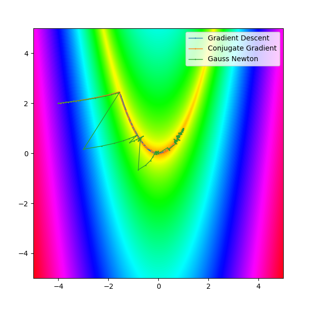

# 3D-Vision

Some 3D vision algorithms

### Augmented Reality

## Camera Pose Estimation

## Dense Stereo

## Point Feature Detection

## Pose Interpolation
The folder *Pose_Manipulation* contains code to interpolation between poses. This is done using spherical linear interpolation (SLERP) for the orientation and linear interpolation for the position.

## Numercial Optimization
The folder *Numerical_Optimization* contains different algorithms for unconstrained non-linear minimization. For example, gradient descent or conjugate gradient.

